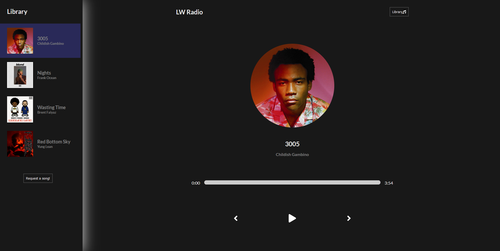

# LW Radio

## Description

LW Radio is a full-stack React application that allows users to listen to songs with a control panel to play, pause, skip forwards, and skip backwards. It also allows users to request songs by using the 'Request a song' button in the library. This sends a POST request to another deployed Heroku server.

Deployed application link: [LW Radio](https://lw-music-player.herokuapp.com/)
Server GitHub link: [LW Radio Server](https://github.com/Leon3005/music-player-server)

## Table of Contents

- [LW Radio](#lw-radio)
  - [Description](#description)
  - [Table of Contents](#table-of-contents)
  - [Installation](#installation)
  - [Usage](#usage)
  - [Screenshots](#screenshots)
  - [Tech/framework used](#techframework-used)
  - [Scripts](#scripts)
  - [Tests](#tests)
  - [Contact](#contact)

## Installation

```
npm install
```

## Usage

To use LW Radio, simply choose a song that you would like to listen to and hit play. To request a song to be added, head over to the Library and fill out the 'Request a song' form!

## Screenshots

Homepage:


## Tech/framework used

<b>Built with</b>

- [Node.js](https://nodejs.org/en/)
- [React](https://reactjs.org//)
- [MongoDB](https://www.mongodb.com/)
- [Mongoose](https://www.npmjs.com/package/mongoose)
- [Express](https://expressjs.com/)
- [Sass](https://sass-lang.com/)
- [Amazon S3](https://aws.amazon.com/s3/)

## Scripts

You can use the below scripts to run the app:

```
npm run start
```

## Tests

N/A

## Contact

For any issues, please contact [my email](mailto:leonwheeler08@gmail.com) 😀
